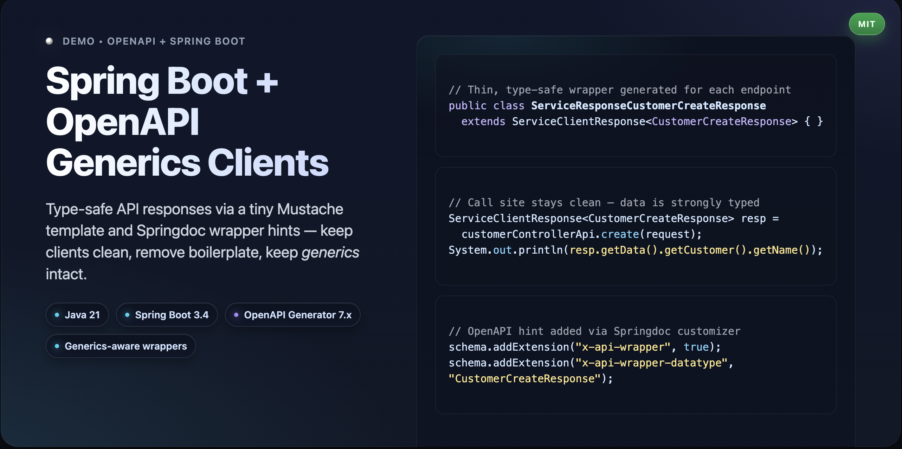
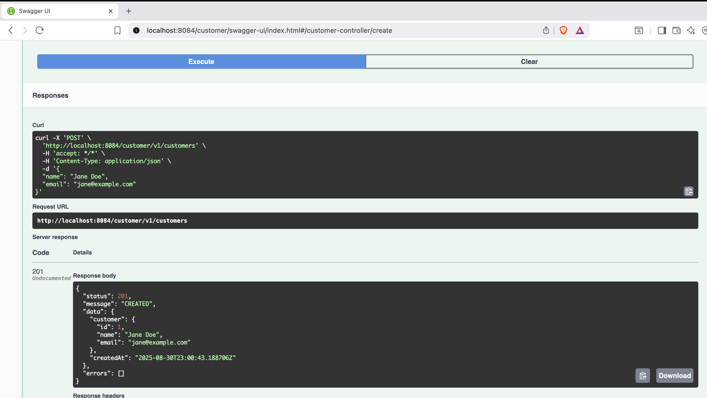
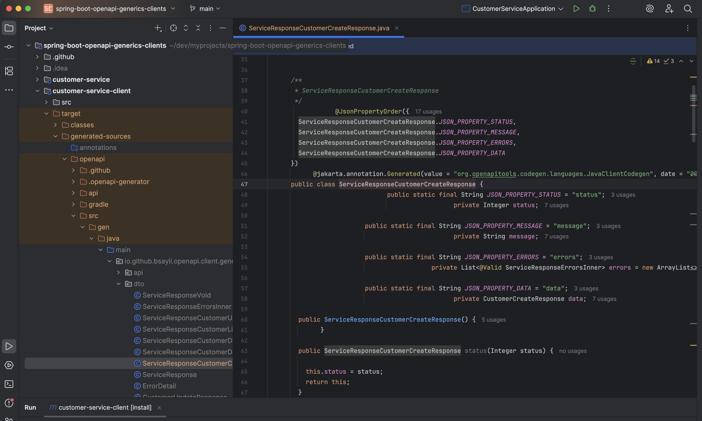
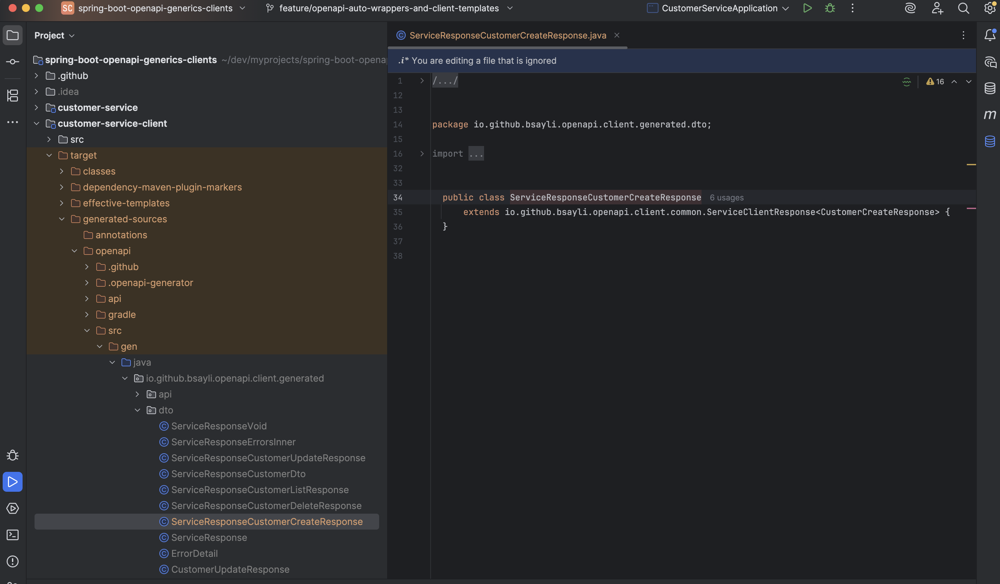

# spring-boot-openapi-generics-clients

[](https://github.com/bsayli/spring-boot-openapi-generics-clients/actions/workflows/build.yml)
[](https://github.com/bsayli/spring-boot-openapi-generics-clients/releases/latest)
[](https://openjdk.org/projects/jdk/21/)
[](https://spring.io/projects/spring-boot)
[](https://openapi-generator.tech/)
[](LICENSE)

<p align="center">
  
  <br/>
  <em>Type-safe API responses without boilerplate — powered by Spring Boot & OpenAPI Generator</em>
</p>

**Type-safe client generation with Spring Boot & OpenAPI using generics.**
This repository demonstrates how to teach OpenAPI Generator to work with generics in order to avoid boilerplate, reduce
duplicated wrappers, and keep client code clean.

---

## 🚀 Problem Statement

Most backend teams standardize responses with a generic wrapper like `ServiceResponse<T>`.
However, **OpenAPI Generator does not natively support generics** — instead, it generates one wrapper per endpoint (
duplicating fields like `status`, `message`, and `errors`).

This creates:

* ❌ Dozens of almost-identical classes
* ❌ High maintenance overhead
* ❌ No single place to evolve the response envelope

---

## 💡 Solution

This project shows how to:

* Customize **Springdoc** to mark wrapper schemas in OpenAPI
* Add a **tiny Mustache partial** so the generator emits thin shells extending a reusable generic base
* Keep **compile-time type safety** without repetitive mappers

---

## ⚡ Quick Start

Run the sample service:

```bash
cd customer-service
mvn spring-boot:run
```

Generate and build the client:

```bash
cd customer-service-client
mvn clean install
```

Use the generated API:

```java
ServiceClientResponse<CustomerCreateResponse> response =
        customerControllerApi.createCustomer(request);
```

### 🖼 Demo Swagger Screenshot

Here’s what the `create customer` endpoint looks like in Swagger UI after running the service:



### 🖼 Generated Client Wrapper

Comparison of how OpenAPI Generator outputs looked **before** vs **after** adding the generics-aware wrapper:

**Before (duplicated full model):**



**After (thin generic wrapper):**


---

## 🛠 Tech Stack & Features

* 🚀 **Java 21** — modern language features
* 🍃 **Spring Boot 3.4.9** — microservice foundation
* 📖 **Springdoc OpenAPI** — API documentation
* 🔧 **OpenAPI Generator 7.x** — client code generation
* 🧩 **Custom Mustache templates** — generics-aware wrappers
* 🧪 **JUnit 5 + MockWebServer** — integration testing
* 🌐 **Apache HttpClient 5** — connection pooling & timeouts

---

## 📂 Project Structure

```text
spring-boot-openapi-generics-clients/
 ├── customer-service/          # Sample Spring Boot microservice (API producer)
 ├── customer-service-client/   # Generated client using custom templates
 └── README.md                  # Root documentation
```

---

## 🧩 Key Features

* ✅ **Generic base model**: `ServiceClientResponse<T>`
* ✅ **Thin wrappers**: endpoint-specific shells extending the base
* ✅ **Strong typing preserved**: `getData()` returns the exact payload type
* ✅ **No duplicated fields** across wrappers
* ✅ Easy to maintain and evolve

---

### ✨ Usage Example: Adapter Interface

Sometimes you don’t want to expose all the thin wrappers directly.  
A simple adapter interface can consolidate them into clean, type-safe methods:

```java
public interface CustomerClientAdapter {
   ServiceClientResponse<CustomerCreateResponse> createCustomer(CustomerCreateRequest request);

   ServiceClientResponse<CustomerDto> getCustomer(Integer customerId);

   ServiceClientResponse<CustomerListResponse> getCustomers();

   ServiceClientResponse<CustomerUpdateResponse> updateCustomer(
           Integer customerId, CustomerUpdateRequest request);

   ServiceClientResponse<CustomerDeleteResponse> deleteCustomer(Integer customerId);
}
```
---

## 🔍 Why This Matters

Without generics support, OpenAPI client generation creates bloated and repetitive code.
By applying this approach:

* Development teams **save time** maintaining response models
* Client libraries become **cleaner and smaller**
* Easier for **new developers** to understand the contract
* Code stays **future-proof** when envelope fields evolve

---

## 💼 Use Cases

This pattern is useful when:

* You have **multiple microservices** with a shared response structure
* You need to **evolve response envelopes** without breaking dozens of generated classes
* You want **type safety** in generated clients but without boilerplate

---

## 🔧 How to Run

1. **Start the sample service**

   ```bash
   cd customer-service
   mvn spring-boot:run
   ```

2. **Generate the client**

   ```bash
   cd customer-service-client
   mvn clean install
   ```

3. **Use the generated API**

   ```java
   ServiceClientResponse<CustomerCreateResponse> response =
       customerControllerApi.createCustomer(request);
   ```

---

## 📖 Related Article

This repository is based on my article:
👉 [Type-Safe Generic API Responses with Spring Boot 3.4, OpenAPI Generator, and Custom Templates](https://medium.com/@baris.sayli/type-safe-generic-api-responses-with-spring-boot-3-4-openapi-generator-and-custom-templates-ccd93405fb04)

---

## 🛡 License

MIT

---

✅ **Note:** CLI examples should always be provided **on a single line**.
If parameters include spaces or special characters, wrap them in quotes `"..."`.

---

## 💬 Feedback

If you spot any mistakes in this README or have questions about the project, feel free to open an issue or start a
discussion. I’m happy to improve the documentation and clarify concepts further!

## ⭐ Support

If you found this project useful, please consider giving it a star ⭐ on GitHub — it helps others discover it too!
