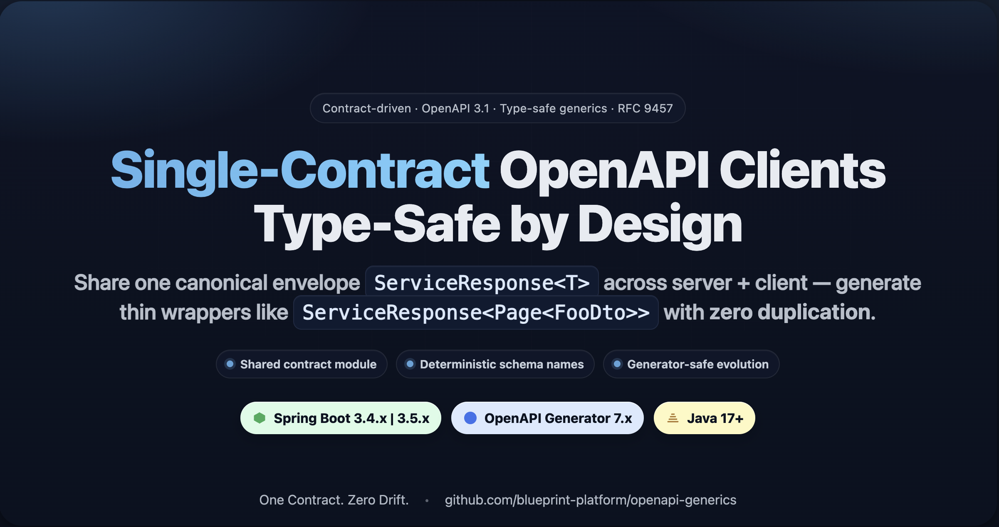
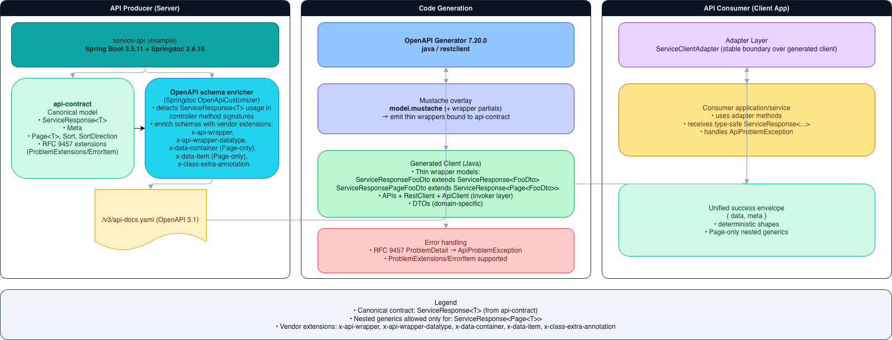
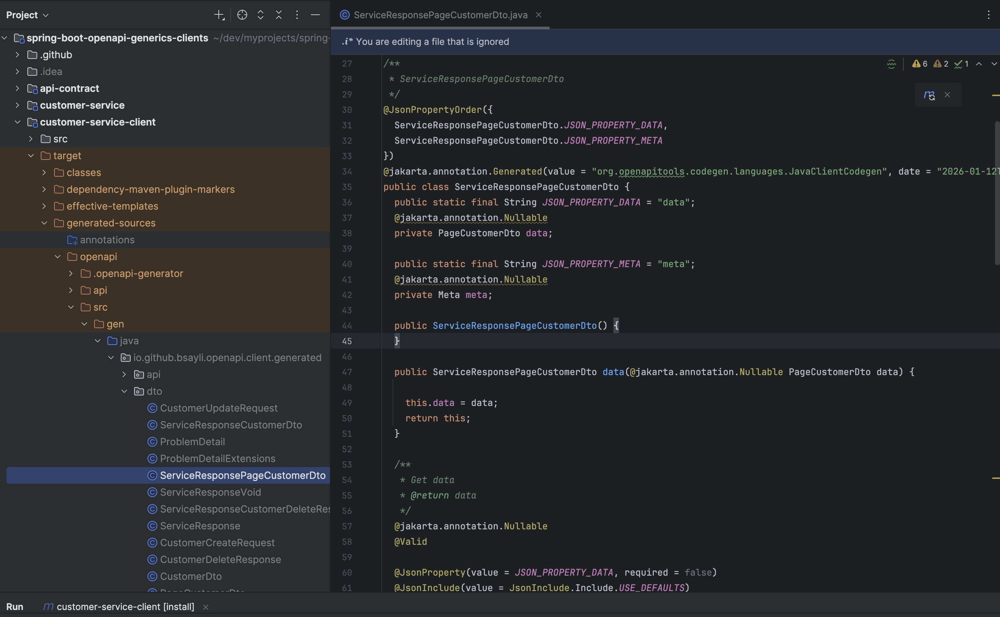
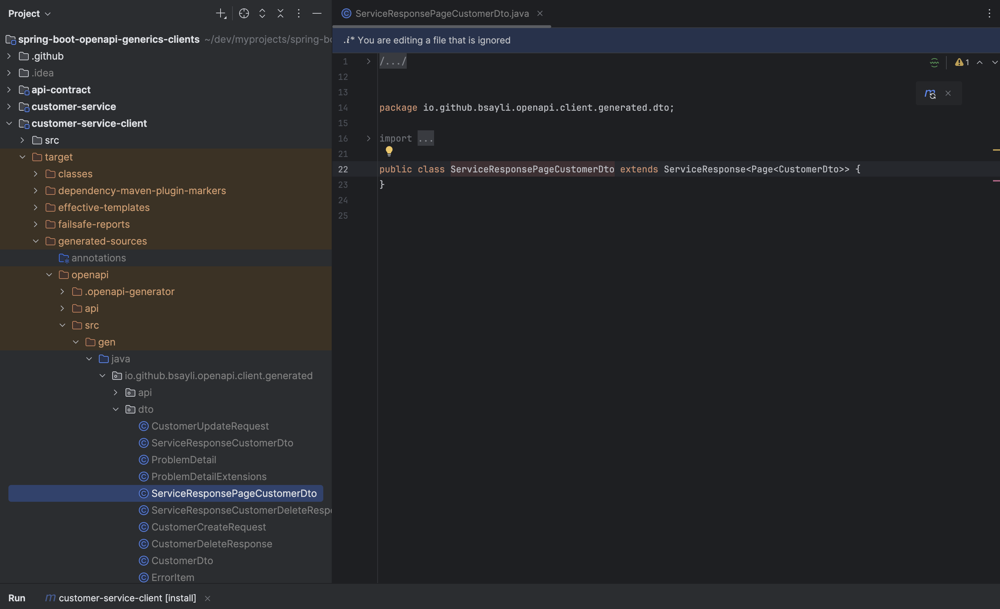

# Spring Boot OpenAPI Generics — Contract‑Driven, End‑to‑End Type Safety

[](https://github.com/bsayli/spring-boot-openapi-generics-clients/actions/workflows/build.yml)
[](https://github.com/bsayli/spring-boot-openapi-generics-clients/releases/latest)
[](https://codecov.io/gh/bsayli/spring-boot-openapi-generics-clients)
[](https://openjdk.org/projects/jdk/21/)
[](https://spring.io/projects/spring-boot)
[](https://openapi-generator.tech/)
[](LICENSE)

<p align="center">
  
  <br/>
  <em><strong>Contract‑driven, generics‑aware OpenAPI clients</strong> — one response model, zero drift.</em>
</p>

This repository is a **reference architecture** for building **end‑to‑end, generics‑aware APIs** with **Spring Boot**, **Springdoc**, and **OpenAPI Generator**.

It demonstrates a **single‑contract approach** where **server and client share the same canonical response model**:

```java
ServiceResponse<T>
```

- No duplicated envelopes
- No parallel client contracts
- No generics erased at generation time

The result is a **deterministic, type‑safe API boundary** with **Page‑aware generics** and **RFC 9457‑compliant error handling**.

---

## 📑 Table of Contents

* 📦 [Modules](#-modules)
* ⚡ [Quick Start](#-quick-start)
* 🚨 [The Problem](#-the-problem)
* 💡 [The Core Idea](#-the-core-idea)
* 🧱 [Canonical Contract](#-canonical-contract)
* 🏗 [Architecture Overview](#-architecture-overview)
* 🔎 [Proof: Generated Client Models (Before/After)](#-proof-generated-client-models-beforeafter)
* 🧩 [Example Responses](#-example-responses)
* 🧠 [Design Guarantees](#-design-guarantees)
* 📘 [Adoption Guides](#-adoption-guides)
* 🔗 [References & External Links](#-references--external-links)

---

## 📦 Modules

* **[api-contract](api-contract/README.md)**  
  Shared, framework-agnostic API contract defining the canonical `{ data, meta }` response model,  
  pagination primitives, and RFC 9457 error extensions.  
  This module is the **single source of truth** shared by both server and client.

* **[customer-service](customer-service/README.md)**  
  Spring Boot API producer exposing a deterministic **OpenAPI 3.1** specification enriched with  
  generics semantics (`ServiceResponse<T>`, `ServiceResponse<Page<T>>`).

* **[customer-service-client](customer-service-client/README.md)**  
  Generated Java client that **reuses the canonical contract** and preserves generics  
  without duplicating envelopes or paging models.

---

## ⚡ Quick Start

This repository uses an **aggregator (root) build** to guarantee that the shared **`api-contract`** module is always available to both the server and the client.
For first-time users, **start from the repo root**.

---

### ✅ Option A — Recommended (Deterministic, First-Time Setup)

This is the **canonical way** to get everything running after cloning the repository.
It installs `api-contract` locally and builds all modules in the correct order.

```bash
# 1) Build everything once from the repo root
mvn -q -ntp clean install

# 2) Run the backend service
cd customer-service && mvn -q -ntp spring-boot:run
```

At this point:

* `api-contract` is installed into your local Maven repository
* `customer-service` is running
* `customer-service-client` has been generated and compiled

No additional setup is required.

---

### 🔄 Option B — Regenerate the Client from the Live OpenAPI Spec

Use this flow **only when you change the server contract** and want to regenerate
client wrappers from the live OpenAPI definition.

```bash
# 1) Ensure the backend is running
cd customer-service && mvn -q -ntp spring-boot:run

# 2) Pull the OpenAPI spec into the client module
cd ../customer-service-client
curl -s http://localhost:8084/customer-service/v3/api-docs.yaml \
  -o src/main/resources/customer-api-docs.yaml

# 3) Regenerate and build the client
mvn -q -ntp clean install
```

This regenerates **thin wrappers** extending the canonical contract:

```java
ServiceResponse<T>
ServiceResponse<Page<T>>
```

---

### 📂 Generated Sources

Generated client sources are written to:

```
customer-service-client/target/generated-sources/openapi/src/gen/java
```

They are **automatically added to compilation** via `build-helper-maven-plugin`.

---

### 📝 Notes

* You do **not** need to manually build or install `api-contract`.
  The root build handles this by design.
* If you skip the root build and run the client directly, the build may fail
  because `api-contract` is not yet available.
* For CI and local parity, all commands use `-ntp` (no transfer progress).

---

> **Rule of thumb:**
> - If you just cloned the repo → **build from root**
> - If you changed the API contract → **regenerate the client**

---

## 🚨 The Problem

Most real‑world APIs wrap responses with:

* metadata (pagination, sorting, timestamps)
* payload data
* standardized error objects

Yet OpenAPI‑based generators typically:

* erase generics
* duplicate response envelopes per endpoint
* break type safety for nested containers

Resulting in clients like:

```java
// Typical generated output (problematic)
class ServiceResponseCustomerDto {
  CustomerDto data;
  Meta meta;
}

class ServiceResponsePageCustomerDto {
  PageCustomerDto data; // lost Page<CustomerDto>
  Meta meta;
}
```

This scales poorly and makes contract evolution painful.

---

## 💡 The Core Idea

**Treat the response envelope as a shared contract — not a generated artifact.**

* The server **publishes intent**, not Java shapes.
* The client **reuses the same contract types**.
* OpenAPI is used as a **semantic bridge**, not a code generator of truth.

Everything revolves around a single, stable abstraction:

```java
ServiceResponse<T>
```

---

## 🧱 Canonical Contract

All successful responses — on **both server and client** — use:

```java
ServiceResponse<T>
```

Provided by the shared module:

```
io.github.bsayli:api-contract
```

### Supported Shapes

| Shape                      | Supported | Notes                           |
| -------------------------- | --------- | ------------------------------- |
| `ServiceResponse<T>`       | ✅         | Default envelope                |
| `ServiceResponse<Page<T>>` | ✅         | **Only allowed nested generic** |
| `ServiceResponse<List<T>>` | ❌         | Treated as raw type             |
| Arbitrary nested generics  | ❌         | Explicitly rejected             |

This restriction is **intentional** — it guarantees deterministic schema names and generator‑safe evolution.

---

## 🏗 Architecture Overview

<p align="center">
  
  <br/>
  <em>End-to-end, generics-aware OpenAPI architecture: from Spring Boot producer to type-safe client consumption.</em>
</p>

```
[service-api]
   └─ publishes OpenAPI 3.1 specification
        └─ enriched with wrapper semantics (vendor extensions)
              │
              ▼
[generated client]
   └─ thin wrapper models extending ServiceResponse<T>
        └─ APIs + RestClient + ApiClient (invoker layer)
              │
              ▼
[consumer application]
   └─ depends only on adapter interfaces
```

### Architectural principles

* **Contract-first** — the OpenAPI specification describes *contracts*, not implementations.
* **Canonical envelope** — all successful responses share a unified `{ data, meta }` shape via `ServiceResponse<T>`.
* **Deterministic generics** — nested generics are intentionally limited to `ServiceResponse<Page<T>>`.
* **Generator-safe** — thin wrapper classes are emitted via Mustache overlays, not handwritten code.
* **Adapter boundary** — consumer services depend on stable adapters, never on generated APIs directly.

### Layers at a glance

| Layer                       | Responsibility                                                                                                             |
| --------------------------- | -------------------------------------------------------------------------------------------------------------------------- |
| **API Producer (Server)**   | Spring Boot service publishing an **OpenAPI 3.1** spec via Springdoc, backed by the shared `api-contract`                  |
| **OpenAPI Schema Enricher** | `OpenApiCustomizer` detecting `ServiceResponse<T>` and emitting vendor extensions (`x-api-wrapper`, `x-data-container`, …) |
| **Code Generation**         | OpenAPI Generator **7.18.0** (`java / restclient`) with Mustache overlays bound to the canonical contract                  |
| **Generated Client**        | Thin wrapper models, domain DTOs, APIs, `RestClient`, and `ApiClient` (invoker layer)                                      |
| **Error Handling**          | RFC 9457 **Problem Details** decoded into `ApiProblemException` with extension support                                     |
| **API Consumer**            | Application/service layer using adapter interfaces and receiving fully type-safe responses                                 |

> **Key rule**
>
> The OpenAPI specification is the *single source of truth*. Generated code is disposable; contracts are not.

---

## 🔎 Proof: Generated Client Models (Before/After)

**Before (duplicated models):**

<p align="center">
  
</p>

**After (thin wrappers):**

<p align="center">
  
</p>

```java
public class ServiceResponsePageCustomerDto
    extends ServiceResponse<Page<CustomerDto>> {}
```

No duplicated envelope. No lost generics.

---

## 🧩 Example Responses

### Single Item

```json
{
  "data": { "customerId": 1, "name": "Jane Doe" },
  "meta": { "serverTime": "2025-01-01T12:34:56Z", "sort": [] }
}
```

### Paged

```json
{
  "data": {
    "content": [ { "customerId": 1 }, { "customerId": 2 } ],
    "page": 0,
    "size": 5,
    "totalElements": 37,
    "totalPages": 8,
    "hasNext": true,
    "hasPrev": false
  },
  "meta": { "serverTime": "2025-01-01T12:34:56Z" }
}
```

---

## 🧠 Design Guarantees

This architecture guarantees:

* **One response contract** across server and client
* **No duplicated envelopes**
* **Page‑only nested generics**
* **Deterministic schema names**
* **RFC 9457‑first error handling**
* **Generator‑safe long‑term evolution**

This is not a demo.

It is a **reference architecture**.

---

## 📘 Adoption Guides

Step-by-step integration guides live under [`docs/adoption`](docs/adoption):

- **[Server-Side Adoption](docs/adoption/server-side-adoption.md)** — Publish a deterministic, generics-aware OpenAPI 3.1 contract.
- **[Client-Side Adoption](docs/adoption/client-side-adoption.md)** — Configure Maven, OpenAPI Generator, and Mustache templates (build-time setup only).
---

## 🔗 References & External Links

- 📘 **Adoption Guide (GitHub Pages)**  
  [Spring Boot OpenAPI Generics — Adoption Guide](https://bsayli.github.io/spring-boot-openapi-generics-clients/)

- ✍️ **Medium Article**  
  [We Made OpenAPI Generator Think in Generics](https://medium.com/@baris.sayli/type-safe-generic-api-responses-with-spring-boot-3-4-openapi-generator-and-custom-templates-ccd93405fb04)

- 📄 **RFC 9457**  
  [Problem Details for HTTP APIs](https://www.rfc-editor.org/rfc/rfc9457)

---


## 🤝 Contributing & Feedback

This repository is a **reference architecture**, not a closed framework.

If you:

* apply this pattern in a real project,
* spot an inconsistency,
* or want to evolve the contract or templates,

feel free to open an issue or start a discussion:

👉 [Discussions](https://github.com/bsayli/spring-boot-openapi-generics-clients/discussions)

Even short, practical feedback helps refine the pattern.

---

## 🛡 License

Licensed under **MIT** — see [LICENSE](LICENSE).

All modules inherit the same license.

---

**Barış Saylı**
[GitHub](https://github.com/bsayli) · [Medium](https://medium.com/@baris.sayli) · [LinkedIn](https://www.linkedin.com/in/bsayli)
