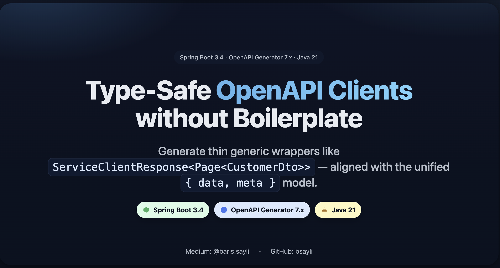

# Spring Boot + OpenAPI Generator — Type-Safe Generics for Clean API Clients

[](https://github.com/bsayli/spring-boot-openapi-generics-clients/actions/workflows/build.yml)
[](https://github.com/bsayli/spring-boot-openapi-generics-clients/releases/latest)
[](https://codecov.io/gh/bsayli/spring-boot-openapi-generics-clients)
[](https://openjdk.org/projects/jdk/21/)
[](https://spring.io/projects/spring-boot)
[](https://openapi-generator.tech/)
[](LICENSE)

---

<p align="center">
  
  <br/>
  <em>End-to-end generics-aware OpenAPI clients — unified `{ data, meta }` responses without boilerplate.</em>
</p>

**Type-safe client generation with Spring Boot & OpenAPI using generics.**
This repository demonstrates how to extend OpenAPI Generator to support **nested generics** and the new unified
`{ data, meta }` response model — eliminating duplicated wrappers and repetitive boilerplate.

---

## 📑 Table of Contents

* 📦 [Modules](#-modules-in-this-repository)
* 🚀 [Problem & Motivation](#-problem--motivation)
* 💡 [Solution Overview](#-solution-overview)
* ⚙️ [New Architecture Highlights](#-new-architecture-highlights)
* ⚡ [Quick Start](#-quick-start)
* 🧩 [Tech Stack](#-tech-stack)
* ✅ [Key Features](#-key-features)
* ✨ [Usage Example](#-usage-example)
* 📘 [Adoption Guides](#-adoption-guides)
* 🔗 [References & Links](#-references--links)

> *A practical reference for building fully generics-aware OpenAPI clients using Spring Boot 3.4, Java 21, and Mustache
overlays.*

---

## 📦 Modules in this Repository

* [**customer-service**](customer-service/README.md) — sample backend exposing `/v3/api-docs.yaml`
* [**customer-service-client**](customer-service-client/README.md) — generated OpenAPI client with generics-aware
  wrappers

---

## 🚀 Problem & Motivation

OpenAPI Generator doesn’t natively understand **generic types**. When backend responses use envelopes like
`ServiceResponse<T>`, the generator produces one wrapper per endpoint, duplicating fields (`status`, `message`,
`errors`, or now `data`, `meta`).

This leads to:

* ❌ Dozens of nearly identical classes
* ❌ High maintenance cost
* ❌ Hard-to-evolve contracts

---

## 💡 Solution Overview

This repository defines a **complete pattern** for Spring Boot + OpenAPI Generator:

* On the **server side**, a `Springdoc` customizer automatically marks generic wrappers (`ServiceResponse<T>`) with
  vendor extensions:

    * `x-api-wrapper`
    * `x-api-wrapper-datatype`
    * `x-data-container` / `x-data-item`
* On the **client side**, Mustache overlays generate **thin wrappers** extending the reusable generic base class
  `ServiceClientResponse<T>`.

Example generated wrapper:

```java
public class ServiceResponseCustomerDto
        extends ServiceClientResponse<CustomerDto> {
}
```

This new structure supports **nested generics** like `ServiceClientResponse<Page<CustomerDto>>` and includes both `data`
and `meta` sections.

---

## ⚙️ New Architecture Highlights

| Layer                 | Description                                                                                     |
|-----------------------|-------------------------------------------------------------------------------------------------|
| **Server (Producer)** | Publishes `/v3/api-docs.yaml` via Springdoc; marks generic wrappers with vendor extensions      |
| **Client (Consumer)** | Uses OpenAPI Generator 7.16.0 with custom Mustache templates to produce generics-aware wrappers |
| **Envelope Model**    | Unified `{ data, meta }` response model; compatible with `ProblemDetail` (RFC 7807) for errors  |
| **Nested Generics**   | Full support for `ServiceResponse<Page<T>>` structures                                          |

---

## ⚡ Quick Start

```bash
# Run the backend service
cd customer-service && mvn spring-boot:run

# Generate and build the OpenAPI client
cd ../customer-service-client && mvn clean install
```

Generated wrappers are located under:

```
target/generated-sources/openapi/src/gen/java
```

Each wrapper extends `ServiceClientResponse<T>` and is aligned with the new `{ data, meta }` envelope.

---

## 🧱 Example Response

```json
{
  "data": {
    "customerId": 1,
    "name": "Jane Doe",
    "email": "jane@example.com"
  },
  "meta": {
    "serverTime": "2025-01-01T12:34:56Z",
    "sort": []
  }
}
```

Client usage:

```java
ServiceClientResponse<CustomerDto> response = api.getCustomer(1);
CustomerDto dto = response.getData();
Instant serverTime = response.getMeta().serverTime();
```

---

## 🧩 Tech Stack

| Component             | Version | Purpose                        |
|-----------------------|---------|--------------------------------|
| **Java**              | 21      | Language baseline              |
| **Spring Boot**       | 3.4.10  | REST + OpenAPI provider        |
| **Springdoc**         | 2.8.13  | OpenAPI 3.1 integration        |
| **OpenAPI Generator** | 7.16.0  | Generics-aware code generation |
| **HttpClient5**       | 5.5     | Production-grade HTTP backend  |

---

## ✅ Key Features

* **Unified `{ data, meta }` response model**
* **Nested generic support** — `ServiceResponse<Page<T>>`
* **RFC 7807-compliant error mapping** via `ClientProblemException`
* **Mustache template overlay** for type-safe wrapper generation
* **End-to-end compatibility** between backend & client
* **No duplicated models or boilerplate**

---

## ✨ Usage Example

```java
public interface CustomerClientAdapter {
    ServiceClientResponse<CustomerDto> createCustomer(CustomerCreateRequest request);

    ServiceClientResponse<CustomerDto> getCustomer(Integer customerId);

    ServiceClientResponse<Page<CustomerDto>> getCustomers();
}
```

This interface provides a clean boundary for your business logic to consume the generated API in a type-safe manner.

---

## 📘 Adoption Guides

See the detailed step-by-step setup under [`docs/adoption`](docs/adoption):

* [Server-Side Adoption](docs/adoption/server-side-adoption.md)
* [Client-Side Adoption](docs/adoption/client-side-adoption.md)

---

## 🔗 References & Links

* 🌐 [GitHub Pages — Adoption Guides](https://bsayli.github.io/spring-boot-openapi-generics-clients/)
*
📘 [Medium — Type-Safe Generic API Responses](https://medium.com/@baris.sayli/type-safe-generic-api-responses-with-spring-boot-3-4-openapi-generator-and-custom-templates-ccd93405fb04)
*
💬 [Dev.to — Type-Safe OpenAPI Clients Without Boilerplate](https://dev.to/barissayli/spring-boot-openapi-generator-type-safe-generic-api-clients-without-boilerplate-3a8f)

---

## 🛡 License

This repository is licensed under **MIT** (see [LICENSE](LICENSE)). Submodules inherit the license.

---

✅ **Note:** CLI examples should always be provided on a single line.  
If parameters include spaces or special characters, wrap them in quotes `"..."`.

---

## 💬 Feedback

If you spot any mistakes in this README or have questions about the project, feel free to open an issue or start a
discussion. I’m happy to improve the documentation and clarify concepts further!

---

## 🤝 Contributing

Contributions, issues, and feature requests are welcome!  
Feel free to [open an issue](../../issues) or submit a PR.

---

## ⭐ Support

If you found this project useful, please consider giving it a star ⭐ on GitHub — it helps others discover it too!

---

**Barış Saylı**  
[GitHub](https://github.com/bsayli) · [Medium](https://medium.com/@baris.sayli)