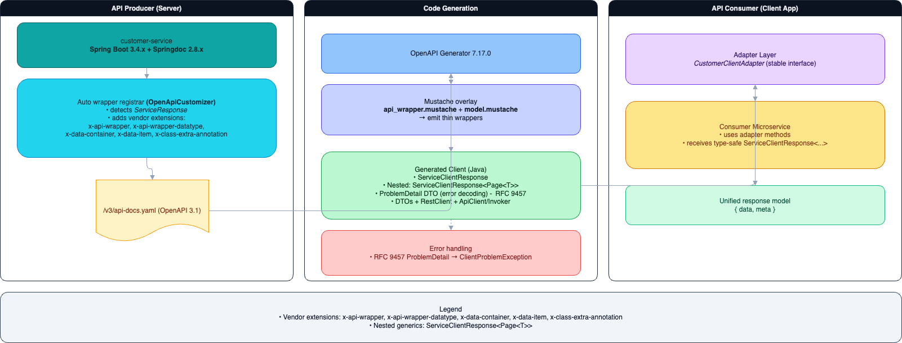

# Spring Boot + OpenAPI Generator — End-to-End Generics-Aware API Clients

[](https://github.com/bsayli/spring-boot-openapi-generics-clients/actions/workflows/build.yml)
[](https://github.com/bsayli/spring-boot-openapi-generics-clients/releases/latest)
[](https://codecov.io/gh/bsayli/spring-boot-openapi-generics-clients)
[](https://openjdk.org/projects/jdk/21/)
[](https://spring.io/projects/spring-boot)
[](https://openapi-generator.tech/)
[](LICENSE)

---

<p align="center">
  
  <br/>
  <em>End-to-end generics-aware OpenAPI clients — unified <code>{ data, meta }</code> responses without boilerplate.</em>
</p>

**Modern, type-safe OpenAPI client generation** — powered by **Spring Boot 3.4**, **Java 21**, and **OpenAPI Generator
7.16.0**.
This repository demonstrates a production-grade architecture where backend and client are fully aligned through
generics, enabling nested generic envelopes (ServiceResponse<Page<T>>) and RFC 7807 ProblemDetail (Problem Details for
HTTP APIs)–based error handling.

---

## 📑 Table of Contents

* 📦 [Modules](#-modules)
* 🚀 [Problem & Motivation](#-problem--motivation)
* 💡 [Solution Overview](#-solution-overview)
* ⚙️ [New Architecture Highlights](#-new-architecture-highlights)
* ⚡ [Quick Start](#-quick-start)
* 🖼 [Generated Client Wrapper — Before & After](#-generated-client-wrapper--before--after)
* 🧱 [Example Responses](#-example-responses)
* 🧩 [Tech Stack](#-tech-stack)
* ✅ [Key Features](#-key-features)
* ✨ [Usage Example](#-usage-example)
* 📘 [Adoption Guides](#-adoption-guides)
* 🔗 [References & Links](#-references--links)

> *A clean architecture pattern for building generics-aware OpenAPI clients that stay fully type-safe, consistent, and
boilerplate-free.*

---

## 📦 Modules

* [**customer-service**](customer-service/README.md) — sample backend exposing `/v3/api-docs.yaml` via Springdoc
* [**customer-service-client**](customer-service-client/README.md) — generated OpenAPI client with generics-aware
  wrappers

---

## 🚀 Problem & Motivation

OpenAPI Generator, by default, does not handle **generic response types**.  
When backend APIs wrap payloads in `ServiceResponse<T>` (e.g., the unified `{ data, meta }` envelope),
the generator produces **duplicated models per endpoint** instead of a single reusable generic base.

This results in:

* ❌ Dozens of almost-identical response classes
* ❌ Higher maintenance overhead
* ❌ Harder to evolve a single envelope contract across services

---

## 💡 Solution Overview

This project provides a **full-stack pattern** to align Spring Boot services and OpenAPI clients:

### Server-Side (Producer)

A `Springdoc` customizer automatically scans controller return types and marks generic wrappers (`ServiceResponse<T>`)
using vendor extensions:

```yaml
x-api-wrapper: true
x-api-wrapper-datatype: CustomerDto
x-data-container: Page
x-data-item: CustomerDto
```

### Client-Side (Consumer)

Mustache overlays redefine OpenAPI templates to generate **thin, type-safe wrappers** extending a reusable base class
`ServiceClientResponse<T>`.

**Example generated output:**

```java
public class ServiceResponseCustomerDto extends ServiceClientResponse<CustomerDto> {
}
```

This pattern supports **nested generics** like `ServiceClientResponse<Page<CustomerDto>>` and maps all error responses
into **ProblemDetail** objects.

---

## ⚙️ New Architecture Highlights

<p align="center">
  
  <br/>
  <em>End-to-end generics-aware architecture: from Spring Boot producer to OpenAPI client consumer.</em>
</p>

| Layer                 | Description                                                               |
|-----------------------|---------------------------------------------------------------------------|
| **Server (Producer)** | Publishes OpenAPI 3.1 spec with auto-registered wrapper schemas           |
| **Client (Consumer)** | Uses OpenAPI Generator 7.16.0 + Mustache overlays for generics support    |
| **Envelope Model**    | Unified `{ data, meta }` response structure                               |
| **Error Handling**    | RFC 7807-compliant `ProblemDetail` decoding into `ClientProblemException` |
| **Nested Generics**   | Full support for `ServiceResponse<Page<T>>`                               |

---

## ⚡ Quick Start

```bash
# Run the backend service
cd customer-service && mvn spring-boot:run

# Generate and build the OpenAPI client
cd ../customer-service-client && mvn clean install
```

Generated wrappers appear under:

```
target/generated-sources/openapi/src/gen/java
```

Each wrapper extends `ServiceClientResponse<T>` and aligns perfectly with the `{ data, meta }` envelope model.

---

## 🖼 Generated Client Wrapper — Before & After

Comparison of how OpenAPI Generator outputs looked **before** vs **after** enabling the generics-aware wrapper support.

**Before (duplicated full model):**

<p align="center">
  
  <br/>
  <em>Each endpoint generated its own full response model — duplicated <code>data</code> and <code>meta</code> fields across classes.</em>
</p>

**After (thin generic wrapper):**

<p align="center">
  
  <br/>
  <em>Now every endpoint extends the reusable <code>ServiceClientResponse&lt;Page&lt;T&gt;&gt;</code> base, eliminating boilerplate and preserving type safety.</em>
</p>

--- 

## 🧱 Example Responses

The unified envelope applies to both single and paged responses. Below is a paged example:

### Paged Example (`ServiceClientResponse<Page<CustomerDto>>`)

```json
{
  "data": {
    "content": [
      {
        "customerId": 1,
        "name": "Jane Doe",
        "email": "jane@example.com"
      },
      {
        "customerId": 2,
        "name": "John Smith",
        "email": "john@example.com"
      }
    ],
    "page": 0,
    "size": 5,
    "totalElements": 37,
    "totalPages": 8,
    "hasNext": true,
    "hasPrev": false
  },
  "meta": {
    "serverTime": "2025-01-01T12:34:56Z",
    "sort": [
      {
        "field": "CUSTOMER_ID",
        "direction": "ASC"
      }
    ]
  }
}
```

Client usage:

```java
ServiceClientResponse<Page<CustomerDto>> resp =
        customerClientAdapter.getCustomers(
                "Jane", null, 0, 5, SortField.CUSTOMER_ID, SortDirection.ASC);

Page<CustomerDto> page = resp.getData();
for(
CustomerDto c :page.

content()){
        // ...
        }
```

---

## 🧩 Tech Stack

| Component             | Version | Purpose                               |
|-----------------------|---------|---------------------------------------|
| **Java**              | 21      | Language baseline                     |
| **Spring Boot**       | 3.4.10  | REST + OpenAPI provider               |
| **Springdoc**         | 2.8.13  | OpenAPI 3.1 integration               |
| **OpenAPI Generator** | 7.16.0  | Generics-aware code generation        |
| **HttpClient5**       | 5.5     | Pooled, production-ready HTTP backend |

---

## ✅ Key Features

* 🔹 Unified `{ data, meta }` response model
* 🔹 Nested generics support — `ServiceResponse<Page<T>>`
* 🔹 RFC 7807-compliant error mapping (`ProblemDetail`)
* 🔹 Mustache overlay templates for thin wrapper generation
* 🔹 Seamless compatibility between backend and client
* 🔹 Zero boilerplate — clean, evolvable, and type-safe

---

## ✨ Usage Example

```java
public interface CustomerClientAdapter {
    ServiceClientResponse<CustomerDto> createCustomer(CustomerCreateRequest request);

    ServiceClientResponse<CustomerDto> getCustomer(Integer customerId);

    ServiceClientResponse<Page<CustomerDto>> getCustomers();
}
```

This adapter defines a stable contract that hides generated artifacts and provides type-safe access to your APIs.

---

## 📘 Adoption Guides

See the detailed integration steps under [`docs/adoption`](docs/adoption):

* [Server-Side Adoption](docs/adoption/server-side-adoption.md)
* [Client-Side Adoption](docs/adoption/client-side-adoption.md)

---

## 🔗 References & Links

* 🌐 [GitHub Pages — Adoption Guides](https://bsayli.github.io/spring-boot-openapi-generics-clients/)
* 📘 [Medium — Type-Safe Generic API Responses](https://medium.com/@baris.sayli/type-safe-generic-api-responses-with-spring-boot-3-4-openapi-generator-and-custom-templates-ccd93405fb04)
* 💬 [Dev.to — Type-Safe OpenAPI Clients Without Boilerplate](https://dev.to/barissayli/spring-boot-openapi-generator-type-safe-generic-api-clients-without-boilerplate-3a8f)

---

## 🛡 License

Licensed under **MIT** — see [LICENSE](LICENSE).

---

## 💬 Feedback

If you spot an error or have suggestions, open an issue or join the discussion — contributions are welcome.  
💭 [Start a discussion →](https://github.com/bsayli/spring-boot-openapi-generics-clients/discussions)

---

## 🤝 Contributing

Contributions, issues, and feature requests are welcome!  
Feel free to [open an issue](https://github.com/bsayli/spring-boot-openapi-generics-clients/issues) or submit a PR.

---

## ⭐ Support

If you found this project helpful, please give it a ⭐ on GitHub — it helps others discover it.

---

**Barış Saylı**
[GitHub](https://github.com/bsayli) · [Medium](https://medium.com/@baris.sayli)
