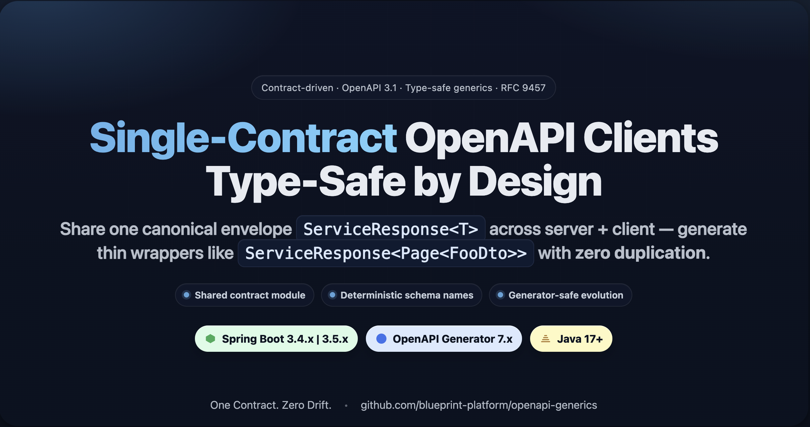
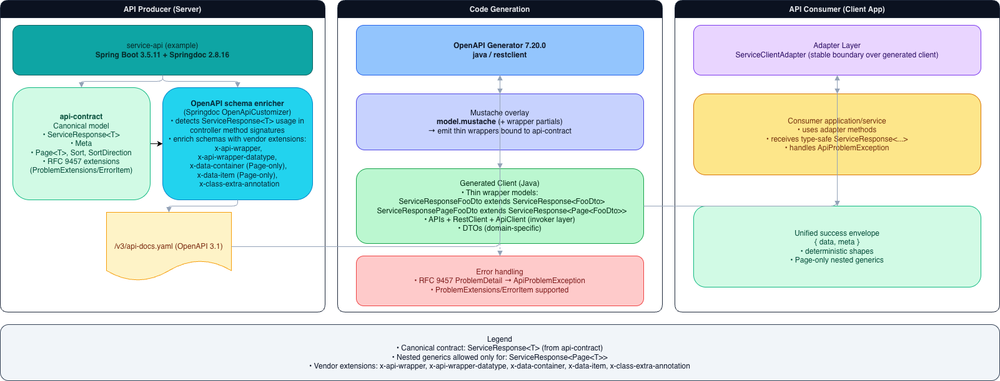
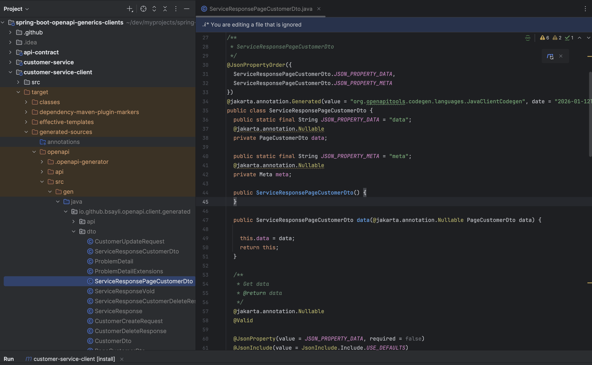
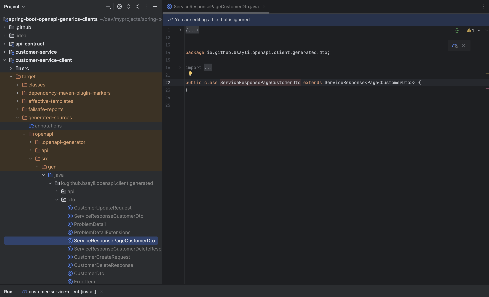

# Spring Boot OpenAPI Generics — Preserve Your API Contract End-to-End

[](https://github.com/blueprint-platform/openapi-generics/actions/workflows/build.yml)
[](https://github.com/blueprint-platform/openapi-generics/releases/latest)
[](https://github.com/blueprint-platform/openapi-generics/actions/workflows/codeql.yml)
[](https://codecov.io/gh/bsayli/spring-boot-openapi-generics-clients)
[](https://openjdk.org/projects/jdk/21/)
[](https://spring.io/projects/spring-boot)
[](https://openapi-generator.tech/)
[](LICENSE)

<p align="center">
  
  <br/>
  <strong>
    OpenAPI shouldn’t redefine your contract.
  </strong>
  <br/>
  <em>
   Preserve it end-to-end.
  </em>
</p>

---

## 📑 Table of Contents

* 🧭 [Architectural Thesis](#architectural-thesis)
* ⚡ [Real Usage (What you actually do)](#-real-usage-what-you-actually-do-in-your-project)
* ⚡ [Quick Start](#-quick-start-2-minutes)
* 🧩 [What This Repository Is (and Is Not)](#what-this-repository-is-and-is-not)
* 🔁 [Contract Lifecycle Model](#contract-lifecycle-model)
* 🚨 [The Problem](#the-problem)
* 🧭 [Where This Architecture Helps](#where-this-architecture-helps)
* 💡 [Core Architectural Idea](#core-architectural-idea)
* 🧱 [Canonical Contract Scope](#canonical-contract-scope)
* 🚫 [Architectural Non-Goals](#architectural-non-goals)
* 🏗 [System Architecture Overview](#system-architecture-overview)
* 🔎 [Proof — Generated Client Models (Before / After)](#proof--generated-client-models-before--after)
* 🧠 [Design Guarantees](#design-guarantees)
* 📦 [Modules](#modules)
* 🧠 [Architecture](#-architecture)
* 📘 [Adoption Guides](#adoption-guides)
* 🔗 [References](#references)
* 🤝 [Contributing](#contributing)
* 🛡 [License](#license)

---

## Architectural Thesis

Most teams treat OpenAPI as a source of truth.

That decision quietly shifts ownership of your API contract from your code to a schema generator.

This repository takes the opposite stance:

> **The Java contract is the source of truth. OpenAPI is only a projection.**

When this boundary is preserved, client generation stops being a lossy transformation and becomes a deterministic extension of your runtime model.

The result is simple but important:

* no duplicated envelope models
* no generic type loss
* no schema drift between producer and consumer

---

> **Background reading**
>
> This repository demonstrates the implementation pattern.
> For the architectural reasoning and real-world context behind it:
>
> * [We Made OpenAPI Generator Think in Generics](https://medium.com/@baris.sayli/type-safe-generic-api-responses-with-spring-boot-3-4-openapi-generator-and-custom-templates-ccd93405fb04)

---

## ⚡ Real Usage (What you actually do in your project)

You do **NOT** copy anything from this repository.

You only add the required building blocks:

### Server (producer)

Add the starter:

```xml
<dependency>
  <groupId>io.github.blueprintplatform</groupId>
  <artifactId>openapi-generics-server-starter</artifactId>
  <version>0.8.x</version>
</dependency>
```

### Client (consumer)

Inherit the parent:

```xml
<parent>
  <groupId>io.github.blueprintplatform</groupId>
  <artifactId>openapi-generics-java-codegen-parent</artifactId>
  <version>0.8.x</version>
</parent>
```

That’s it.

Everything else in this repository is a **reference implementation of this setup**.

---

## ⚡ Quick Start (2 minutes)

> Requires Spring Boot 3.4+ and OpenAPI Generator 7.x
> See module documentation for compatibility details.

This repository demonstrates a **contract-first, generics-aware API lifecycle**.

The fastest way to understand it is to:

1. run the producer service
2. inspect the generated OpenAPI
3. generate a client
4. verify that contract semantics are preserved

---

### 1. Run the sample producer

```bash
cd samples/customer-service
mvn clean package
java -jar target/customer-service-*.jar
```

Verify the API is running:

* Swagger UI: [http://localhost:8084/customer-service/swagger-ui/index.html](http://localhost:8084/customer-service/swagger-ui/index.html)
* OpenAPI: [http://localhost:8084/customer-service/v3/api-docs.yaml](http://localhost:8084/customer-service/v3/api-docs.yaml)

---

### 2. Observe the contract shape

```bash
curl http://localhost:8084/customer-service/v1/customers/1
```

```json
{
  "data": { ... },
  "meta": { ... }
}
```

This shape is defined by the **Java contract**, not OpenAPI.

---

### 3. Generate the client

```bash
cd samples/customer-service-client

curl -s http://localhost:8084/customer-service/v3/api-docs.yaml \
  -o src/main/resources/customer-api-docs.yaml

mvn clean install
```

---

### 4. Inspect generated sources

```java
public class ServiceResponsePageCustomerDto
    extends ServiceResponse<Page<CustomerDto>> {}
```

* ✔ No duplicated envelope
* ✔ Generics preserved
* ✔ Contract reused

---

### What just happened?

```text
Java Contract (SSOT)
   ↓
Server (projection)
   ↓
OpenAPI (projection artifact)
   ↓
Generator (enforcement)
   ↓
Client (contract-aligned)
```

---

### 🧠 How this maps to real usage

```text
Add dependency (server)
   ↓
Add parent (client)
   ↓
Run your service
   ↓
Generate client
```

There is no manual model copying.
There is no schema tweaking.
There is no duplication.

> The entire system works by aligning build-time and runtime around a single contract.

---

## What This Repository Is (and Is Not)

This repository is a **reference architecture**, not a framework.

It demonstrates how to:

* keep API contracts as runtime-first abstractions
* publish OpenAPI as a deterministic projection
* generate clients without redefining models
* isolate generated code behind stable boundaries

It does **not** attempt to provide:

* a complete platform solution
* a universal OpenAPI replacement
* a prescriptive architecture for all systems

---

## Contract Lifecycle Model

```
┌────────────────────────────────────┐
│ Canonical Contract (SSOT)          │
└───────────────┬────────────────────┘
                ↓
┌────────────────────────────────────┐
│ OpenAPI Projection (deterministic) │
└───────────────┬────────────────────┘
                ↓
┌────────────────────────────────────┐
│ Client Generation (enforced)       │
└───────────────┬────────────────────┘
                ↓
┌────────────────────────────────────┐
│ Application Usage (adapter-bound)  │
└────────────────────────────────────┘
```

Each step transforms the contract — none of them redefine it.

---

## The Problem

Conventional OpenAPI pipelines tend to:

* regenerate envelope models per endpoint
* flatten generic structures
* introduce unstable schema naming
* drift away from runtime contracts

This leads to:

* duplicated DTO hierarchies
* fragile client regeneration
* unclear integration boundaries

---

## Where This Architecture Helps

This approach is useful when:

* multiple services share a response envelope
* pagination and metadata must remain consistent
* clients are regenerated frequently
* contract drift is a real risk

In these cases, **contract identity becomes an architectural concern**.

---

## Core Architectural Idea

The response envelope is treated as a **shared contract**, not a generated artifact.

```text
ServiceResponse<T>
```

Key rules:

* the server publishes semantics, not shapes
* the client reuses contract types
* OpenAPI carries metadata, not authority

---

## Canonical Contract Scope

| Shape                      | Behavior                 | Description                          |
| -------------------------- | ------------------------ | ------------------------------------ |
| `ServiceResponse<T>`       | Contract-aware           | Canonical success envelope           |
| `ServiceResponse<Page<T>>` | Contract-aware           | Deterministic nested generic support |
| `ServiceResponse<List<T>>` | Default OpenAPI behavior | Treated as a regular schema          |
| Arbitrary nested generics  | Default OpenAPI behavior | No contract-level guarantees         |

---

### Mental model

```text
Use anything → OpenAPI works
Use contract-aware shapes → platform guarantees stability
```

---

## Architectural Non-Goals

This architecture does not attempt to solve:

* arbitrary generic preservation
* cross-language generator parity
* API versioning strategy
* runtime service concerns

Focus remains on:

> preserving contract semantics during client generation

---

## System Architecture Overview

<p align="center">
  
</p>

```
[Producer]
   ↓
OpenAPI (projection)
   ↓
Generated Client
   ↓
Application (adapter)
```

---

## Proof — Generated Client Models (Before / After)

### Before — flattened models

<p align="center">
  
</p>

```java
class ServiceResponsePageCustomerDto {
  PageCustomerDto data;
  Meta meta;
}
```

* envelope duplicated
* generics lost
* drift risk introduced

---

### After — contract-bound wrappers

<p align="center">
  
</p>

```java
public class ServiceResponsePageCustomerDto
    extends ServiceResponse<Page<CustomerDto>> {}
```

* no duplication
* generics preserved
* contract reused

---

## Design Guarantees

- ✔ Contract identity is preserved
- ✔ Schema naming is deterministic
- ✔ Generator behavior is controlled
- ✔ Client regeneration is safe
- ✔ Error model remains consistent (RFC 9457)

---

## Modules

* **[openapi-generics-contract](openapi-generics-contract/README.md)**
  Canonical contract (authority layer)

* **[openapi-generics-server-starter](openapi-generics-server-starter/README.md)**
  Contract → OpenAPI projection

* **[openapi-generics-java-codegen](openapi-generics-java-codegen/README.md)**
  Contract-aware generator

* **[openapi-generics-java-codegen-parent](openapi-generics-java-codegen-parent/README.md)**
  Build orchestration

* **[customer-service](samples/customer-service/README.md)**
  Producer example

* **[customer-service-client](samples/customer-service-client/README.md)**
  Consumer example

---

## 🧠 Architecture

* **[Platform Architecture](docs/architecture/platform.md)**
* **[Server Architecture](docs/architecture/server.md)**
* **[Client Architecture](docs/architecture/client.md)**
* **[Error Handling Strategy](docs/architecture/error-handling.md)**

---

### Key principle

> Each layer transforms the contract, never redefines it.

---

## Adoption Guides

* **[Server-Side Adoption](docs/adoption/server-side-adoption.md)**
* **[Client-Side Adoption](docs/adoption/client-side-adoption.md)**

---

## References

- 📘 **Adoption Guide (GitHub Pages)**  
  [Spring Boot OpenAPI Generics — Adoption Guide](https://bsayli.github.io/spring-boot-openapi-generics-clients/)

- ✍️ **Medium Article**  
  [We Made OpenAPI Generator Think in Generics](https://medium.com/@baris.sayli/type-safe-generic-api-responses-with-spring-boot-3-4-openapi-generator-and-custom-templates-ccd93405fb04)

- 📄 **RFC 9457**  
  [Problem Details for HTTP APIs](https://www.rfc-editor.org/rfc/rfc9457)

---

## Contributing

Architectural discussions, real‑world usage feedback, and evolution proposals are welcome.

Please open an issue or start a discussion in the repository.

👉 [Issues](https://github.com/bsayli/spring-boot-openapi-generics-clients/issues)

👉 [Discussions](https://github.com/bsayli/spring-boot-openapi-generics-clients/discussions)

---

## License

MIT — see [LICENSE](LICENSE)

---

**Barış Saylı**
[GitHub](https://github.com/bsayli) · [Medium](https://medium.com/@baris.sayli) · [LinkedIn](https://www.linkedin.com/in/bsayli)
