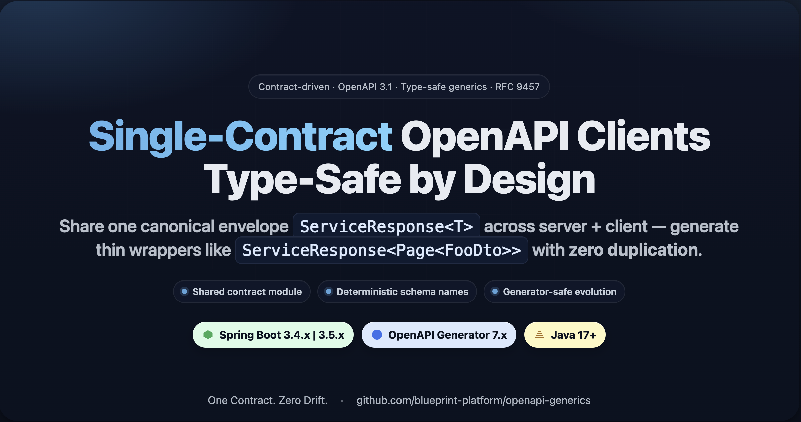
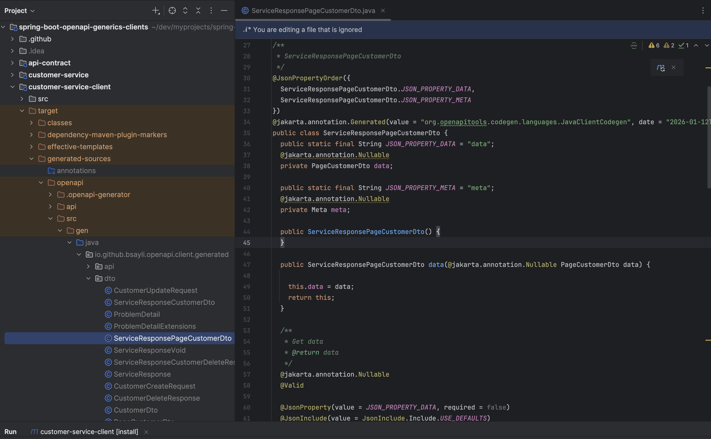
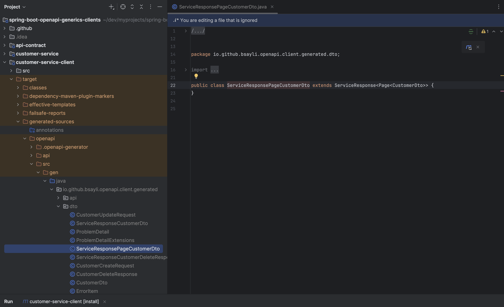
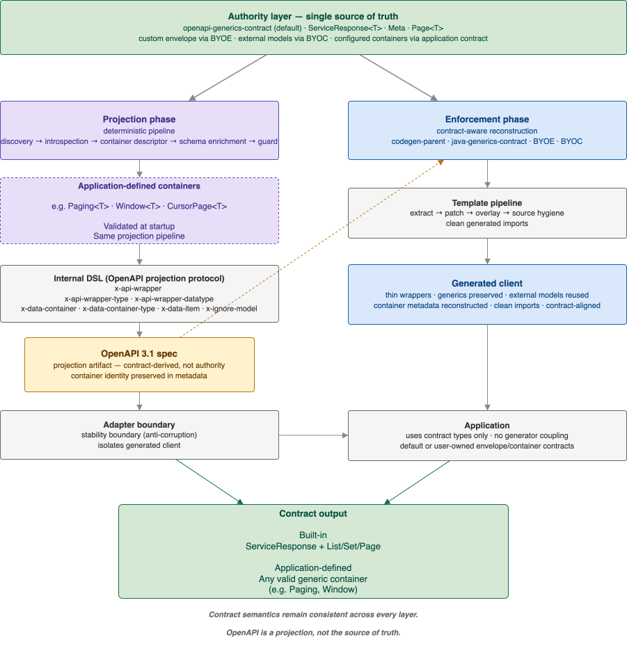

# OpenAPI Generics for Spring Boot — Keep Your API Contract Intact End-to-End

[](https://github.com/blueprint-platform/openapi-generics/actions/workflows/build.yml)
[](https://github.com/blueprint-platform/openapi-generics/actions/workflows/codeql.yml)
[](https://codecov.io/gh/blueprint-platform/openapi-generics)

[](https://github.com/blueprint-platform/openapi-generics/releases/latest)
[](https://central.sonatype.com/artifact/io.github.blueprint-platform/openapi-generics-server-starter)

[](https://openjdk.org/)
[](https://spring.io/projects/spring-boot)
[](https://openapi-generator.tech/)

[](LICENSE)


<p align="center">
  
</p>

<p align="center">
  <strong>Prevent OpenAPI Generator from redefining your Java contract.</strong>
  <br/>
  <sub>A contract-preserving OpenAPI Generator specialization for Java/Spring that keeps shared envelopes and DTOs reusable across service boundaries — no model explosion, no custom template fork to maintain.</sub>
</p>


---

## Table of Contents

* [The problem in 30 seconds](#the-problem-in-30-seconds)
* [Get started](#get-started)
* [Real-World Example](#real-world-example)
* [What's New in 1.2.1](#whats-new-in-121)
* [Key Features](#key-features)
* [How it works](#how-it-works)
* [Compatibility](#compatibility)
* [Relationship to OpenAPI Generator](#relationship-to-openapi-generator)
* [Modules](#modules)
* [References](#references)
* [Contributing](#contributing)
* [License](#license)

---

## The problem in 30 seconds

You return a typed generic contract from a Spring Boot controller:

```java
ResponseEntity<ServiceResponse<Page<CustomerDto>>> getCustomers() { ... }
```

This is not just a JSON shape.

It is a contract boundary.

`ServiceResponse<T>` defines the response language.  
`Page<T>` defines the pagination contract.  
`CustomerDto` defines the payload.

A standard OpenAPI client generation flow often turns that boundary into a generated model:

```java
// ❌ Generated by default
class ServiceResponsePageCustomerDto {
  PageCustomerDto data;
  Meta meta;
}
```

That class may look equivalent, but it is not the same contract anymore.

The envelope has been copied into generated code.
The client now owns a generated reinterpretation of a contract that already existed.

With **openapi-generics**, the generated wrapper keeps the original contract identity:

```java
// ✅ Generated with openapi-generics
public class ServiceResponsePageCustomerDto
    extends ServiceResponse<Page<CustomerDto>> {}
```

The generated class does not redefine the envelope.
It only binds concrete generic parameters to the shared contract type.

<table>
<tr>
<td align="center"><b>Before</b><br/><sub>default OpenAPI Generator</sub></td>
<td align="center"><b>After</b><br/><sub>with openapi-generics</sub></td>
</tr>
<tr>
<td></td>
<td></td>
</tr>
</table>

This is the core architectural difference:

```text
Default generation:
OpenAPI schema becomes the source for a new envelope model.
```

```text
OpenAPI Generics:
The Java contract remains the source of truth.
OpenAPI carries the envelope, payload, and container metadata required to reconstruct it deterministically.
```

For one endpoint, the difference is easy to ignore.

Across many generated clients, it becomes expensive.

A BFF, aggregator, or downstream service may consume dozens of APIs. If every generated client brings its own envelope and container copies, each service boundary adds more duplicated models, more mapping code, and more places for contract drift.

OpenAPI Generics takes the opposite position:

> The response envelope is not generated output.  
> It is shared contract authority.

Payload models may be generated.  
Endpoint clients may be generated.  
Transport code may be generated.

But the envelope should remain owned by the contract.

The result is a generated client that behaves as a thin transport adapter instead of an alternative contract definition.

One envelope.
One contract identity.
Generics preserved from producer to consumer.

> Define your contract once in Java, project it through OpenAPI, and reconstruct it deterministically in the generated client.

---

## Get Started

OpenAPI Generics participates at two points in the contract lifecycle:

```text
Java Producer Contract
        ↓
OpenAPI Projection
        ↓
Contract-Aware Client Reconstruction
```

### 1. See the full lifecycle

The repository contains runnable end-to-end samples covering:

- Spring Boot 3 and Spring Boot 4 reference stacks
- built-in `ServiceResponse<T>` contracts
- BYOE envelopes
- application-defined generic containers
- BYOC reuse
- transport compatibility

Each sample follows the same lifecycle:

```text
Producer
    ↓
OpenAPI
    ↓
Generated Client
    ↓
Consumer
```

Start with [samples/README.md](samples/README.md) for the runnable projects, Docker-based setup, and verification paths.

---

### 2. Add OpenAPI Generics to your project

OpenAPI Generics has separate producer-side and client-side integration points.

#### Producer — project Java contract semantics into OpenAPI

Add the server starter:

```xml
<dependency>
  <groupId>io.github.blueprint-platform</groupId>
  <artifactId>openapi-generics-server-starter</artifactId>
  <version>1.2.1</version>
</dependency>
```

The starter participates only when Springdoc generates the OpenAPI document.

It does not intercept application requests or change endpoint runtime behavior.

For the built-in `ServiceResponse<T>` contract, no envelope configuration is required. Applications using BYOE or application-defined generic containers can declare those contract types on the producer.

See [Server-Side Adoption](docs/adoption/server-side-adoption.md) for the complete configuration model.

#### Client — reconstruct the Java contract during generation

Use the OpenAPI Generics codegen parent:

```xml
<parent>
  <groupId>io.github.blueprint-platform</groupId>
  <artifactId>openapi-generics-java-codegen-parent</artifactId>
  <version>1.2.1</version>
</parent>
```

Configure the official OpenAPI Generator Maven plugin as usual, but select the OpenAPI Generics Java specialization:

```xml
<generatorName>java-generics-contract</generatorName>
```

Normal OpenAPI Generator choices remain consumer-controlled, including the input specification, client library, package layout, and generator options.

The OpenAPI Generics integration prepares the reconstruction-specific template environment and restores the projected generic contract semantics without taking ownership of the ordinary OpenAPI Generator lifecycle.

See [Client-Side Adoption](docs/adoption/client-side-adoption.md) for the complete generator configuration, BYOC mappings, fallback behavior, and generated-source setup.

---

## Real-World Example

See the [Licensing Project](https://github.com/bsayli/licensing) for a complete end-to-end BYOE example using a shared `ApiResponse<T>` contract.

The project demonstrates:

- Spring Boot server integration with `openapi-generics-server-starter`
- Java contract → OpenAPI projection
- Generated Java client using `openapi-generics-java-codegen-parent`
- Shared `ApiResponse<T>` reuse across service, client, SDK, and CLI
- Docker-based end-to-end verification

---

## What's New in 1.2.1

OpenAPI Generics 1.2.1 completes the contract-driven reconstruction metadata model by carrying Java envelope identity in the projected OpenAPI document through `x-api-wrapper-type`.

Together with the container identity metadata introduced in 1.2 through `x-data-container-type`, the document now carries the contract identity required by the Java generator to reconstruct both platform-owned and application-owned generic response contracts.

```text
Java Contract
      ↓
OpenAPI Projection
      ↓
Envelope + Container Identity
      ↓
Generated Client Reconstruction
```

For aligned 1.2.1 producer and codegen components, the Java generator derives the envelope type from the OpenAPI document instead of requiring the same `openapi-generics.envelope` declaration on the client.

The same reconstruction model applies to built-in and application-owned contracts, for example:

```java
ServiceResponse<Page<CustomerDto>>
ApiResponse<Window<CustomerDto>>
```

Highlights in 1.2.1 include:

- contract-driven envelope reconstruction through `x-api-wrapper-type`
- no duplicate client-side envelope configuration for aligned 1.2.1 components
- end-to-end validation of application-defined containers with both built-in and BYOE envelopes
- dedicated transport compatibility coverage for multipart, binary download, and form-urlencoded scenarios
- clearer server-side failure diagnostics through a dedicated exception hierarchy
- Spring Boot 3 and Spring Boot 4 reference-stack verification
- OpenAPI Generator 7.24.0 verification

All 1.2.0 runtime contracts remain backward compatible.

No contract migration is required for existing 1.2 users.

For the complete release history, see the [Changelog](CHANGELOG.md).

---

## Key Features

| Feature                                     | What it does                                                                                                                                                                                              | Default                           |
|---------------------------------------------|-----------------------------------------------------------------------------------------------------------------------------------------------------------------------------------------------------------|-----------------------------------|
| **BYOE** — Bring Your Own Envelope          | Reuse your existing response envelope (for example `ApiResponse<T>`) instead of `ServiceResponse<T>`. No migration required.                                                                              | `ServiceResponse<T>`              |
| **BYOC** — Bring Your Own Contract          | Reuse your existing domain DTOs instead of generating duplicate models.                                                                                                                                   | Generate from spec                |
| **Application-defined containers**          | Register your own generic container contracts (for example `Paging<T>` or `Window<T>`) and have them participate in the same projection, metadata, and reconstruction pipeline as built-in containers.    | Built-in containers only          |
| **Contract-driven envelope reconstruction** | Reconstruct the Java envelope directly from `x-api-wrapper-type` metadata without duplicating envelope configuration on the client.                                                                       | Enabled                           |
| **Container-aware reconstruction**          | Deterministically reconstruct built-in and configured generic container types from OpenAPI metadata instead of using container-specific generation logic.                                                 | Enabled                           |
| **Fallback to standard generation**         | Opt out of generics-aware template patching, or switch fully back to stock OpenAPI Generator behavior with `generatorName=java`.                                                                          | Generics-aware generation enabled |
| **Deterministic reconstruction**            | Apply deterministic template patching, generated-source hygiene, and build-time validation to produce stable, contract-aligned Java clients.                                                              | Enabled                           |
| **End-to-end samples**                      | Complete producer → OpenAPI → generated client → consumer pipelines covering Spring Boot 3/4, `ServiceResponse`, BYOE, application-defined containers, and independent transport compatibility scenarios. | See [samples](samples/)           |

---

### BYOE — Bring Your Own Envelope

Already have an `ApiResponse<T>` or another response envelope shared across your services?

Use it as the contract source of truth without migrating to a platform-specific wrapper.

On the **server/producer** side:

```yaml
openapi-generics:
  envelope:
    type: io.example.contract.ApiResponse

  # Optional: register application-defined generic containers
  containers:
    - type: io.example.contract.Paging
      item-property: content

    - type: io.example.contract.Window
      item-property: items
```

Key characteristics:

- Your envelope remains the contract owner.
- Generated wrappers extend your envelope instead of redefining it.
- The envelope type must be available on the client classpath.
- Springdoc-based projection is automatic.
- Application-defined containers are optional and participate in the same projection and reconstruction model as built-in containers when configured.
- The same metadata protocol can be represented directly in an OpenAPI document when interoperability requires it; Java-contract projection remains the primary architectural model.

---

### BYOC — Bring Your Own Contract

Reuse DTOs you already own instead of generating duplicate models.

Map OpenAPI model names to existing Java types:

```xml
<additionalProperties>
  <additionalProperty>
    openapi-generics.response-contract.CustomerDto=io.example.contract.CustomerDto
  </additionalProperty>
</additionalProperties>
```

Each mapping follows:

```text
openapi-generics.response-contract.<OpenAPI model name>=<fully-qualified Java type>
```

The generated client imports and reuses those contract types directly instead of producing duplicate DTO definitions.

---

### Fallback to Standard Generation

Disable the generics-aware template patching with a single Maven property:

```xml
<openapi.generics.skip>true</openapi.generics.skip>
```

This skips the template extraction, patching, and overlay steps provided by `openapi-generics-java-codegen-parent`.

To fully revert to stock OpenAPI Generator behavior:

```xml
<generatorName>java</generatorName>
```

Use this mode for output comparison, troubleshooting, or temporary opt-out scenarios.

---

## How it works

OpenAPI Generics preserves Java generic contract semantics across the OpenAPI lifecycle.

It keeps generic response envelopes, container payloads, and shared DTO contracts aligned from Spring Boot producers to generated Java clients.

The project is built on one principle:

> The Java contract is the source of truth.  
> OpenAPI is a projection of that contract.  
> Client generation deterministically reconstructs the original contract.

```text
Java Contract (SSOT)
        ↓
OpenAPI Projection
        ↓
Deterministic Client Reconstruction
        ↓
Contract-Aligned Client
```

In practice this means:

- the response envelope remains a **shared contract**, not a generated artifact
- generated wrapper classes **extend** existing contracts instead of redefining them
- OpenAPI carries **contract metadata**, not contract ownership
- container semantics are preserved through projection metadata
- clients and servers remain aligned as contracts evolve

### Projection and metadata paths

Java-contract projection is the primary architectural path. The same metadata protocol can also be represented directly in an OpenAPI document when integration with an externally managed specification requires it.

#### Springdoc-based (automatic)

The server starter discovers generic response contracts, projects wrapper schemas, enriches them with contract metadata, and marks infrastructure models so generated clients reconstruct the original Java contract instead of regenerating it.

#### Direct OpenAPI metadata (interoperability)

Externally managed OpenAPI documents can represent the reconstruction metadata directly through the OpenAPI Generics vendor extensions:

- `x-api-wrapper`
- `x-api-wrapper-type`
- `x-api-wrapper-datatype`
- `x-data-container`
- `x-data-container-type`
- `x-data-item`
- `x-ignore-model`

Together, these extensions describe wrapper semantics, payload type, container identity, item type, and generation behavior. This provides an interoperability path for reconstruction without changing the project's primary Java-contract-as-authority model.

### Architecture

<p align="center">
  
</p>

The architecture consists of two complementary phases:

- **Projection** — derives deterministic OpenAPI metadata from Java contracts.
- **Reconstruction** — restores contract-aligned Java client types during generation using the projected metadata.

Both phases share the same contract authority while keeping generated code isolated from application code.

For internal architecture and design decisions, see the [architecture](docs/architecture/architecture.md) documentation.

### Guarantees

- ✔ Shared Java contracts remain the authority; generated wrappers bind concrete generic parameters instead of redefining the contract.
- ✔ Envelope and container identity survive OpenAPI projection through explicit reconstruction metadata.
- ✔ Built-in, BYOE, BYOC, and registered container semantics participate in the same deterministic Java reconstruction model.
- ✔ Detected reconstruction-specific template drift and contract inconsistencies fail during generation rather than surfacing as silent runtime divergence.

---

## Compatibility

OpenAPI Generics currently supports:

- **Java:** 17+
- **Spring Boot:** 3.4.x, 3.5.x, and 4.x
- **springdoc-openapi:** 2.x with Spring Boot 3.x, and 3.x with Spring Boot 4.x
- **OpenAPI Generator:** 7.x
- **Server integration:** Spring WebMvc via `springdoc-openapi-starter-webmvc-ui`

The repository maintains verified Spring Boot 3, Spring Boot 4, and OpenAPI Generator reference baselines within these supported ranges.

For exact verified versions, the full compatibility matrix, and the support policy, see [Compatibility & Support Policy](docs/compatibility.md).

---

## Relationship to OpenAPI Generator

OpenAPI Generics is not a fork of OpenAPI Generator.

It builds on the upstream project as a focused Java/Spring specialization for preserving contract-owned generic structures across the OpenAPI lifecycle.

The generated OpenAPI document remains valid OpenAPI and can still be consumed by standard OpenAPI tooling; tools that do not understand OpenAPI Generics metadata simply ignore the vendor extensions.

OpenAPI Generics owns the specialization required for:

- generic contract projection and OpenAPI Generics metadata
- preservation of envelope and container identity
- contract-aware Java wrapper reconstruction
- BYOE and BYOC reconstruction semantics
- reconstruction-specific template preparation, validation, and generated-source hygiene

OpenAPI Generator continues to own the ordinary generation concerns outside that specialization, including:

- standard API and model generation
- HTTP transport and client-library behavior
- authentication generation
- serialization behavior
- upstream template structure and generator evolution

The project therefore consumes upstream template structure and applies a minimal generics-aware patch and overlay layer rather than maintaining a forked template set.

This boundary is deliberate: OpenAPI Generics reconstructs generic contract semantics while leaving ordinary OpenAPI generation behavior with the upstream ecosystem.

### Generator Version Ownership

OpenAPI Generics does not lock consumers to a specific OpenAPI Generator version.

The provided parent configuration includes a tested default and defines the supported compatibility line, while consumers may override the `openapi-generator.version` property within the supported 7.x range.

The parent keeps the selected OpenAPI Generator version aligned across plugin execution, generator dependencies, and upstream template extraction so that the reconstruction pipeline uses a consistent toolchain.

> OpenAPI Generics owns contract semantics and declares generator compatibility.  
> Consumers choose the OpenAPI Generator version they run within the supported compatibility line.

---

## Modules

| Module                                                                                   | Responsibility                                                                       |
|------------------------------------------------------------------------------------------|--------------------------------------------------------------------------------------|
| [`openapi-generics-contract`](openapi-generics-contract/README.md)                       | Shared response contracts and platform-owned generic types.                          |
| [`openapi-generics-server-starter`](openapi-generics-server-starter/README.md)           | Spring Boot integration that projects generic contract metadata into OpenAPI.        |
| [`openapi-generics-java-codegen`](openapi-generics-java-codegen/README.md)               | OpenAPI Generator specialization that reconstructs contract-aligned Java clients.    |
| [`openapi-generics-java-codegen-parent`](openapi-generics-java-codegen-parent/README.md) | Maven parent for client generation, template patching, and generated-source hygiene. |
| [`openapi-generics-platform-bom`](openapi-generics-platform-bom/README.md)               | Dependency alignment for OpenAPI Generics modules.                                   |

---

## References

### Project Documentation

- **[Rationale: Why OpenAPI Generics Exists](./docs/architecture/rationale.md)**  
  Explains the architectural motivation, design decisions, engineering trade-offs, and ecosystem constraints behind the project.

- **[Documentation Site](https://blueprint-platform.github.io/openapi-generics/)**  
  Official GitHub Pages documentation for adoption guides, architecture, compatibility, and project usage.

### Articles

- **[We Made OpenAPI Generator Think in Generics](https://medium.com/@baris.sayli/type-safe-generic-api-responses-with-spring-boot-3-4-openapi-generator-and-custom-templates-ccd93405fb04)**  
  Background, motivation, and technical overview of the project.

### Standards & Specifications

- **[OpenAPI Specification](https://spec.openapis.org/oas/latest.html)**  
  Official specification for describing HTTP APIs.

- **[JSON Schema Draft 2020-12](https://json-schema.org/draft/2020-12)**  
  Specification for describing and validating JSON documents.

- **[RFC 9457 – Problem Details for HTTP APIs](https://www.rfc-editor.org/rfc/rfc9457)**  
  Standard format for error responses in HTTP APIs.

---

## Contributing

OpenAPI Generics is still evolving, and real-world feedback is the most valuable input for future improvements.

Whether you're evaluating the project, running it in a prototype, or using it in production, feedback is welcome.

Questions, bug reports, design discussions, and adoption experiences all help shape the roadmap.

For contributions and feedback:

- 🐛 Bugs and issues → [Issues](https://github.com/blueprint-platform/openapi-generics/issues)
- 💡 Design discussions and feature ideas → [Discussions](https://github.com/blueprint-platform/openapi-generics/discussions)
- 🔗 Private feedback → [LinkedIn](https://www.linkedin.com/in/bsayli)

If OpenAPI Generics helped solve a real problem in your environment, hearing about that experience is often just as valuable as a code contribution.

---

## License

MIT — see [LICENSE](LICENSE)

---

**Barış Saylı**
[GitHub](https://github.com/bsayli) · [Medium](https://medium.com/@baris.sayli) · [LinkedIn](https://www.linkedin.com/in/bsayli)


<!-- Scarf tracking pixel - README -->
